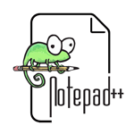

### Thank You for Passing :) 👋

<!--
**sayansinha5/sayansinha5** is a ✨ _special_ ✨ repository because its `README.md` (this file) appears on your GitHub profile.

Here are some ideas to get you started:

- 🔭 I’m currently working on ...
- 🌱 I’m currently learning ...
- 👯 I’m looking to collaborate on ...
- 🤔 I’m looking for help with ...
- 💬 Ask me about ...
- 📫 How to reach me: ...
- 😄 Pronouns: ...
- ⚡ Fun fact: ...
-->
<table>
  <tr>
    <td>100</td>
    <td>200</td>
    <td>300</td>
  </tr>
  <tr>
    <td>400</td>
    <td>500</td>
    <td>600</td>
  </tr>
</table>
<table cellspacing="0" cellpadding="0">
  <tbody>
    <tr>
    <td></td>
    <td>Notepad++ is my favourite editor.</td>
    </tr>
  </tbody>
</table>
